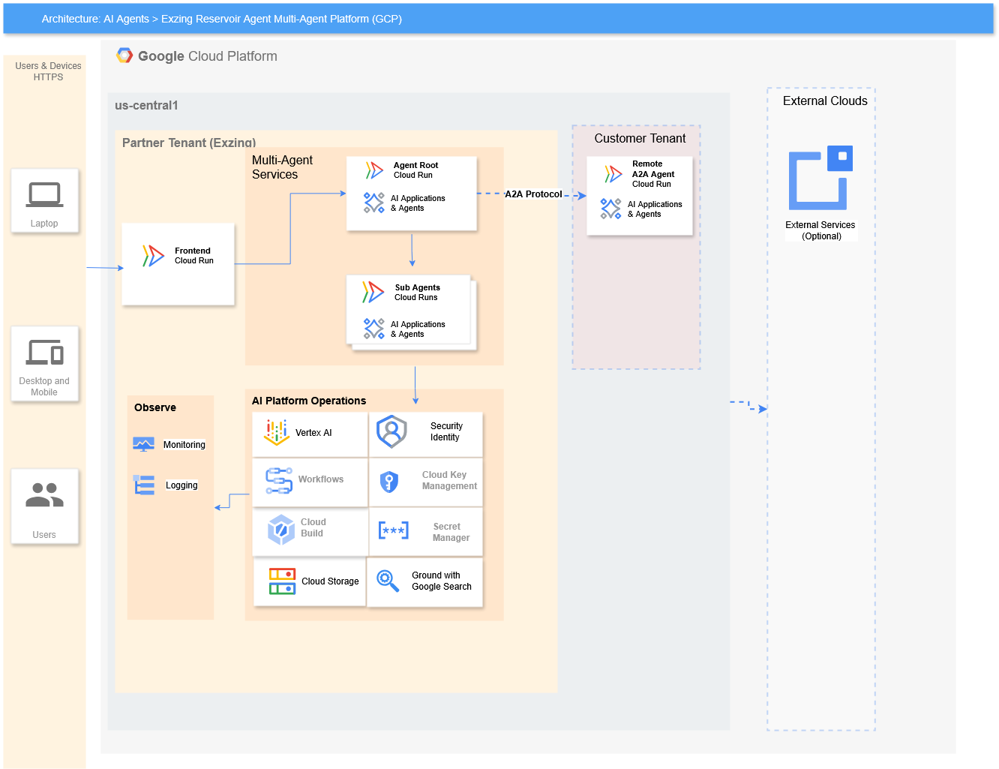

---

```markdown
# Exzing Reservoir Agent — GCP Edition

**Production baseline (Azure):** [Microsoft Marketplace](https://marketplace.microsoft.com/en-us/product/okpo-exzing-research.exzing-reservoir-agent) — ISV Success Level 3, transactable SaaS
**GCP deployment:** [gcpagent.exzing.com](https://gcpagent.exzing.com) — Google Cloud Marketplace listing in progress

---

## What it does

A multi-agent engineering system that automates the most time-intensive stages of the Field Development Planning (FDP) lifecycle for reservoir engineers:

- **Simulation QC** — validates ECLIPSE™ and OPM simulation decks against a 1,500+ keyword reference database, catching physical anomalies and keyword errors before costly simulator runs
- **Production Analysis** — Arps decline curve analysis (DCA), EUR estimation, and production anomaly detection
- **RelPerm Generation** — ECLIPSE SWOF/SGOF relative permeability tables using Corey correlations calibrated to Niger Delta analogues
- **Executive Reporting** — management-ready summaries via A2A protocol, callable by any enterprise system (ERP, HSE platforms)

Deterministic physics tools (Arps, Corey, Winland R35) run **before** LLM interpretation — the model interprets verified engineering outputs, it does not compute them.

---

## Architecture



*(See full-resolution diagram: [`architecture.svg`](./architecture.svg))*

The system runs entirely within our GCP Partner Tenant, with an optional customer-side integration point for enterprise reporting:

- **Frontend:** React + Vite, hosted at `gcpagent.exzing.com` (Cloud Run)
- **Agent layer:** OrchestratorAgent (ADK root), SimulationQCAgent, ProductionAnalystAgent, ReportingAgent — all on Cloud Run, multi-tenant deployment
- **Intelligence:** Gemini 2.5 Flash via Vertex AI
- **Identity & secrets:** GCP Agent Identity (GcpAuthProvider + 3LO), Google Secret Manager
- **Observability:** Cloud Logging and Cloud Monitoring, enabled across all agent services
- **Data:** static engineering reference data (ECLIPSE/OPM keyword database) in Cloud Storage; no client engineering data is persisted — session data is processed in-memory and discarded (Zero Data Retention)
- **A2A protocol:** ReportingAgent exposed via `to_a2a()`, consumable as a `RemoteA2aAgent` by customer-side systems

Full technical documentation: [`/docs`](./docs) *(link to your fuller docs, once written)*

---

## Roadmap

**In progress:**
- **Benchmark evidence pipeline** — a controlled comparison suite measuring QC time and error detection between manual/baseline workflows and Agent-assisted workflows, on a fixed set of representative decks. Results will be published as part of our efficiency evidence base, not inferred from live traffic.
- **Persistent user feedback capture** — a permanent, opt-in feedback feature across both deployments, giving engineers a direct channel to rate and comment on the tool, with results shown publicly.
- **Test coverage** — unit tests for deterministic physics tools, integration tests for agent orchestration and A2A handoff, gated in CI before deploy.

**Planned:**
- **Field-level flare/vent monitoring hardware** — a low-cost sensor and decision-support layer extending the Agent's monitoring capability from simulation-stage QC into live field data, targeting reduction of gas flaring and venting waste in upstream operations. Early-stage bench prototyping.

---

## Quick start (local)

```bash
git clone https://github.com/okpoEkpenyong/reservoir_agent_gcp_alpha.git
cd reservoir_agent_gcp_alpha
pip install -r requirements.txt

cp .env.example .env
# Add GOOGLE_API_KEY from https://aistudio.google.com

# Start the A2A Reporting Agent server
uvicorn serve_reporting:app --host localhost --port 8001

# Start the frontend (React/Vite)
cd frontend
npm install
npm run dev
```

---

## Deployment (Cloud Run)

```bash
# Build and deploy via Cloud Build
gcloud builds submit --config cloudbuild.yaml

# Or deploy directly
gcloud run deploy exzing-reservoir-agent \
  --source . \
  --region us-central1 \
  --allow-unauthenticated
```

---

## Technology stack

- **Intelligence:** Gemini 2.5 Flash via Vertex AI
- **Orchestration:** Google ADK (`google-adk[a2a]`) — `Agent`, `RemoteA2aAgent`, `to_a2a()`
- **Backend:** Python, FastAPI
- **Frontend:** React + Vite
- **Infrastructure:** Google Cloud Run, Cloud Build, Artifact Registry
- **A2A:** `a2a-sdk` — agent card, `to_a2a()`, `RemoteA2aAgent`
- **Secrets:** Google Secret Manager
- **Observability:** Cloud Logging, Cloud Monitoring
- **Safety:** Gemini safety filters, Model Armor, heuristic adversarial pattern detection

---

## File structure

```
reservoir_agent_gcp_alpha/
├── agents/
│   ├── orchestrator/agent.py       ← Root ADK agent
│   ├── simulation_qc/agent.py      ← ECLIPSE/OPM QC sub-agent
│   ├── production_analyst/agent.py ← DCA/EUR/RelPerm sub-agent
│   └── reporting/agent.py          ← A2A-exposed reporting agent
├── tools/
│   └── reservoir_tools.py          ← Deterministic physics tools
├── frontend/                       ← React + Vite UI
├── serve_reporting.py              ← uvicorn A2A server entrypoint
├── main.py                         ← FastAPI backend entrypoint
├── Dockerfile / Dockerfile.corporate / Dockerfile.reporting
├── cloudbuild.yaml                 ← CI/CD pipeline
├── architecture.svg
└── requirements.txt
```

---

## About Exzing Technology Ltd.

Exzing is building engineering software tools for African upstream oil and gas. Production-deployed on Microsoft Commercial Marketplace (Azure ISV Success Level 3). This repository is the Google Cloud edition of the same product.

**Contact:** info@exzing.com | okpo.ekpenyong@gmail.com
```

---